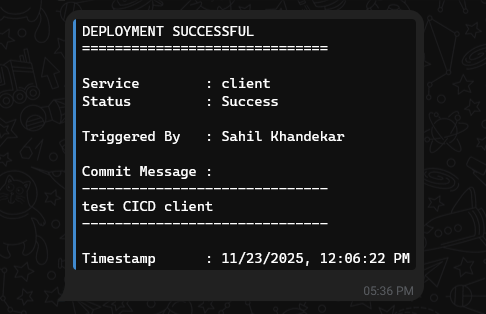
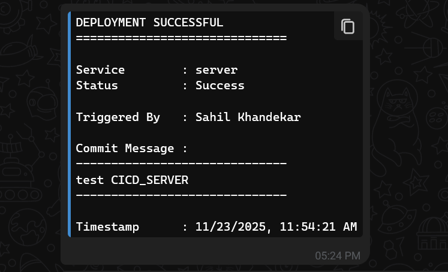
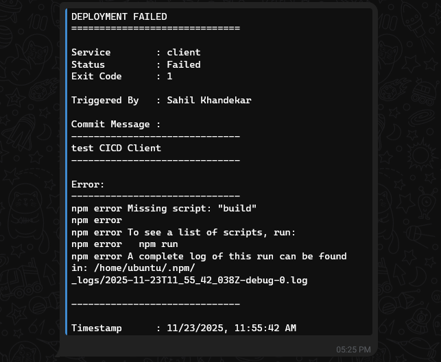
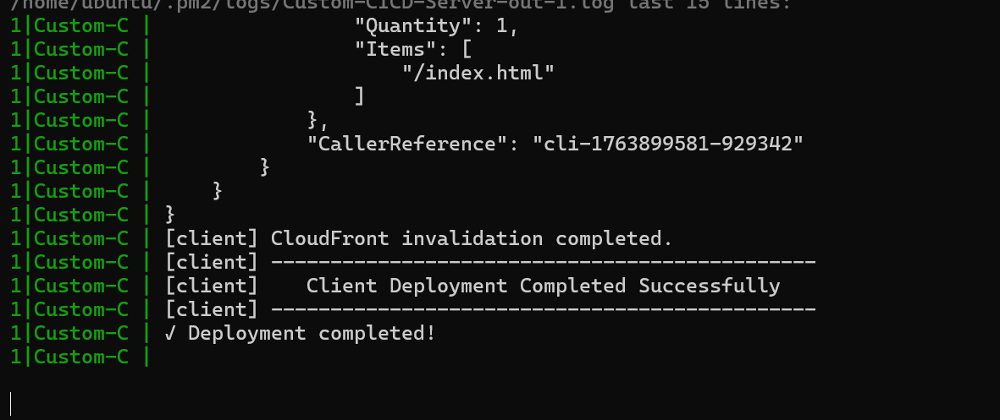
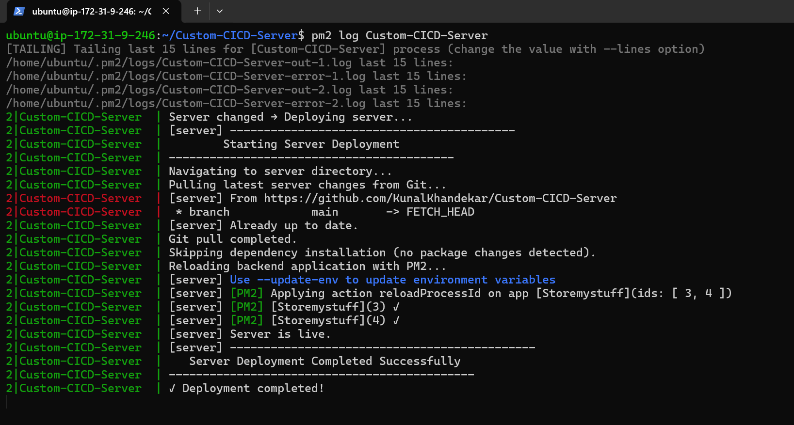

# Custom CI/CD Server

Lightweight Node.js/Express webhook-driven CI/CD service for a monorepo containing `Client/` (frontend) and `Server/` (backend). Automates selective deployment based on changed files.

## Features

- Push event webhook listener (GitHub)
- Commit diff inspection to detect:
  - Client or Server changes
  - Dependency changes (`package.json` / `package-lock.json`)
- Conditional `npm ci` to optimize build time
- Frontend:
  - Build
  - Deploy to AWS S3
  - CloudFront cache invalidation (selective path)
- Backend:
  - `git pull` latest code
  - PM2 reload (zero-downtime)
- Signature verification (HMAC SHA-256)
- Telegram notifications (success & fail)
- Simple health endpoint

## Tech Stack

- Node.js / Express
- PM2 (process manager)
- AWS S3 + CloudFront
- Bash deployment scripts
- GitHub Webhooks
- Telegram Bot API

## Repository Structure

```
├── index.js
├── deploy-client.sh
├── deploy-server.sh
├── middlewares/
│   └── verifySignature.js
├── utils/
│   ├── deploy.js
│   ├── executeScript.js
│   ├── logStream.js
│   └── notify.js
├── .env (Copy)
└── README.md
```

## Requirements

- Node.js (v16+ recommended)
- Git
- PM2 (`npm i -g pm2`)
- AWS CLI (configured with IAM user having S3 + CloudFront permissions)
- GitHub repository (monorepo layout with `Client/` and `Server/`)
- Telegram bot

## Installation

```bash
git clone <this-repo-url> CICD_SERVER
cd CICD_SERVER
npm install
```

## Environment Configuration

Create `.env` from `.env copy` template:

```ini
# Deployment
S3_BUCKET=your-bucket
CF_DISTRIBUTION_ID=your-dist-id

# Absolute paths to project folders on server
CLIENT_PROJECT_DIR=/home/ubuntu/Storage-App/Client
SERVER_PROJECT_DIR=/home/ubuntu/Storage-App/Server

# CI/CD Server
PORT=5001
GITHUB_SECRET=your_webhook_secret
TELEGRAM_BOT_TOKEN=your_bot_token
TELEGRAM_CHAT_ID=your_chat_id
```

Security notes:
- Never commit `.env`.
- Use least-privilege AWS IAM policies (S3 sync + CloudFront invalidation only).
- Rotate tokens periodically.

## Make Scripts Executable

```bash
chmod +x deploy-client.sh deploy-server.sh
```

## Start CI/CD Service

```bash
pm2 start index.js --name cicd-server
pm2 save
```

Health check:

```
GET http://<HOST>:5001/health
```

## GitHub Webhook Setup

In repo Settings → Webhooks:
- Payload URL: `http://<HOST>:5001/webhook/tigger-deployment`
- Content type: `application/json`
- Secret: same as `GITHUB_SECRET`
- Event: Just the push event

## Deployment Logic

1. Receive push payload.
2. Inspect commits:
   - Mark `clientChanged` if any path starts with `Client/`
   - Mark `serverChanged` if any path starts with `Server/`
   - Flag dependency changes if package files touched.
3. If nothing deployable: exit.
4. Client:
   - Conditional `npm ci`
   - `npm run build`
   - `aws s3 sync dist/ s3://$S3_BUCKET --delete`
   - CloudFront invalidation (`/index.html`)
5. Server:
   - `git pull origin main`
   - Conditinal `npm ci`
   - `pm2 reload Storemystuff`

## Screenshots

### Telegram Notifications
| Description | Image |
|-------------|-------|
| Client deploy success |  |
| Server deploy success |  |
| Failure |  |

### Logs
| Description | Image |
|-------------|-------|
| Webhook received |  |
| Client build |  |
| Server reload |  |
| No changes |  |

